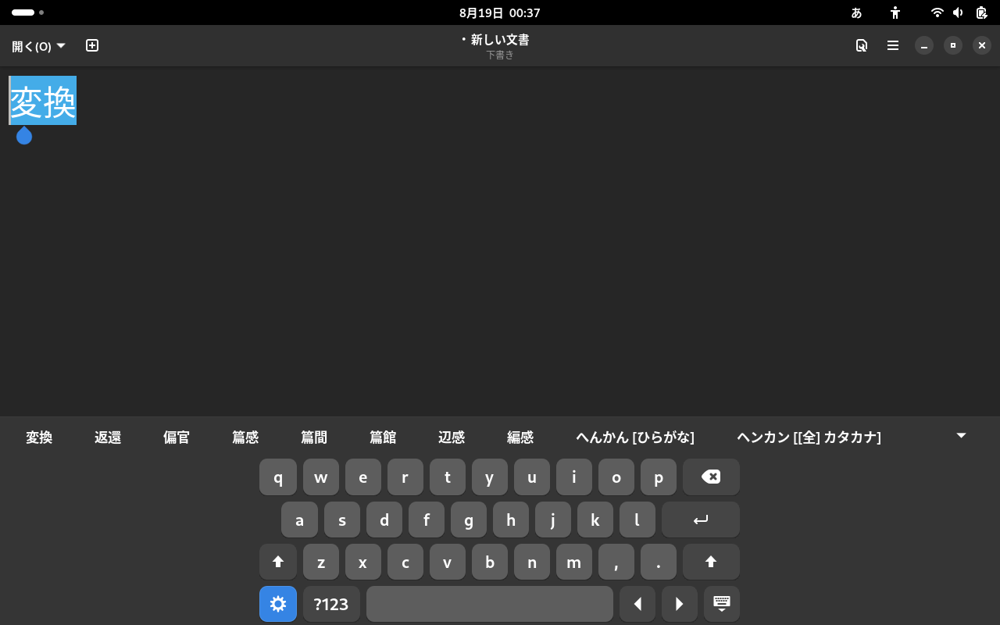

[](./README.md)

# GNOME Shell Extension: IM Panel integrated with OSK

IM Panel integrated with OSK は、GNOME OnScreen Keyboardにいくつかの機能を追加することで、タッチスクリーンでの入力メソッドの操作を改善する拡張機能です。

この拡張機能は [gnome-shell-extension-kimpanel](https://github.com/wengxt/gnome-shell-extension-kimpanel) を元にしています。

## Features

- オンスクリーンキーボードに入力メソッド切り替えキーを追加
- オンスクリーンキーボードに変換候補を表示

## Screenshots

</img>

## Installation

### GNOME Extensions Websiteからインストール
1. [拡張機能のページ](https://extensions.gnome.org/extension/7239/im-panel-integrated-with-osk/)にアクセスします。
1. 「On/Off」スイッチをクリックしてインストールします。

### 手動インストール

1. リポジトリをクローンするか、ダウンロードする:
   ```bash
   git clone https://github.com/hallelujahdrive/impanel-with-osk.git
   ```
1. 拡張機能のディレクトリに移動:
   ```bash
   cd impanel-with-osk
   ```
1. ビルドしてインストール:
   ```bash
   make all
   make install
   ```
1. GNOME Shellを再起動 (Alt + F2を入力後, rを入力してEnterを押下).

## Usage

この拡張機能はkimpanelのインターフェースを使用するため、[gnome-shell-extension-kimpanel](https://github.com/wengxt/gnome-shell-extension-kimpanel)と同時に使用することができません。gnome-shell-extension-kimpanelを使用している場合は必ず無効にしてください。

1. GNOME Extension Managerを開く.
1. "IM Panel integrated with OSK"を有効にする.
