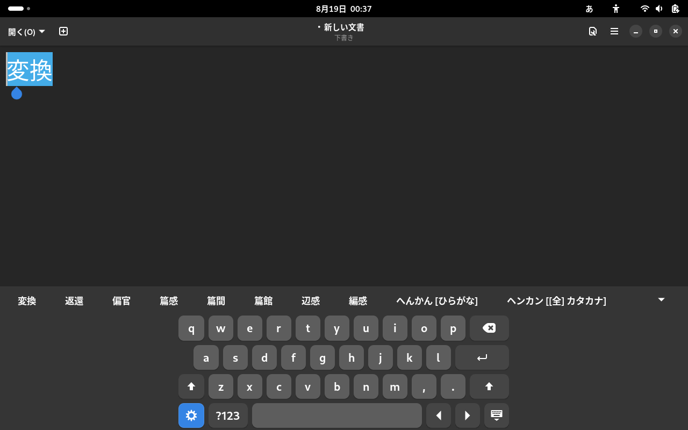

[](./README.md)
[](./README.ja.md)

# GNOME Shell Extension: IM Panel integrated with OSK

IM Panel Integrated with OSK is a GNOME Shell extension that improves the operation of input methods on touch screens by adding several features to the GNOME OnScreen Keyboard.

This extension is based on [gnome-shell-extension-kimpanel](https://github.com/wengxt/gnome-shell-extension-kimpanel).

## Features

- Adds a IM switching button to Gnome OnScreen Keyboard.
- Displays conversion suggestions on Gnome OnScreen keyboard

## Screenshots

</img>

## Installation

### Manual Installation

1. Clone or download the repository:
   ```bash
   git clone https://github.com/hallelujahdrive/impanel-with-osk.git
   ```
1. Navigate to the extension directory:
   ```bash
   cd impanel-with-osk
   ```
1. Build the extension and install it:
   ```bash
   make all
   make install
   ```
1. Restart GNOME Shell (press Alt + F2, type r, and press Enter).

## Usage


This extension uses the kimpanel interface and cannot be used at the same time as [gnome-shell-extension-kimpanel](https://github.com/wengxt/gnome-shell-extension-kimpanel). If you are using gnome-shell-extension-kimpanel, be sure to disable it.

1. Open GNOME Extension Manager.
1. Enable "IM Panel integrated with OSK".

## Contributing

Bug reports and feature suggestions are welcome on GitHub Issues. Pull requests are also appreciated.

## License

This project is licensed under the GNU General Public License,
version 3. See the [LICENSE](LICENSE) file for more details.
